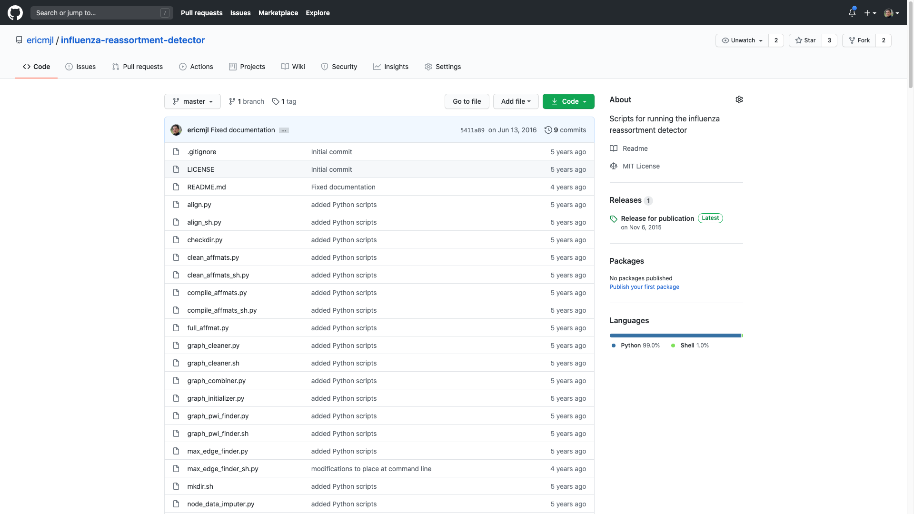
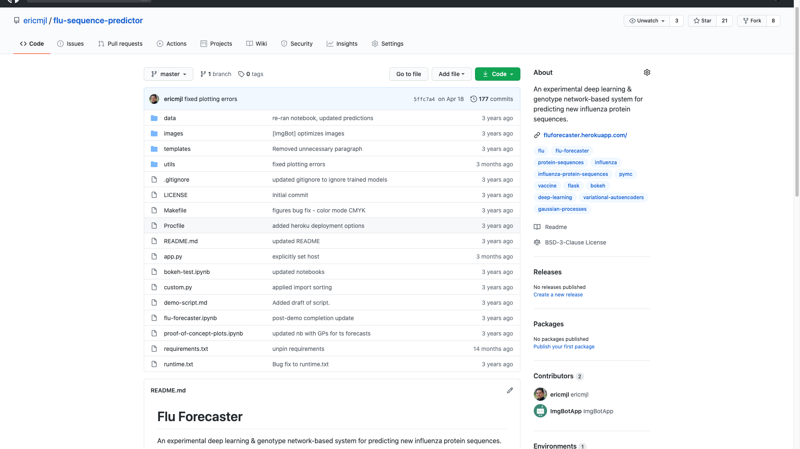
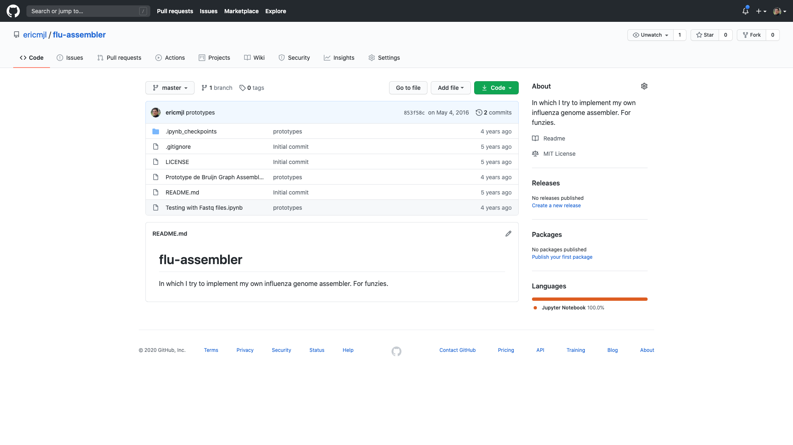
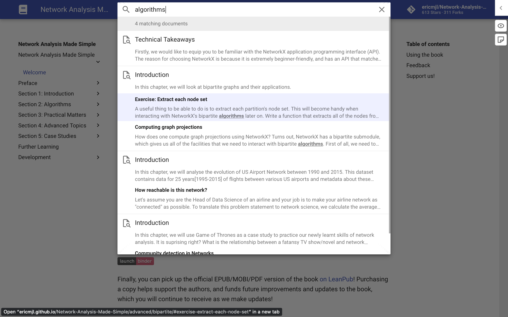
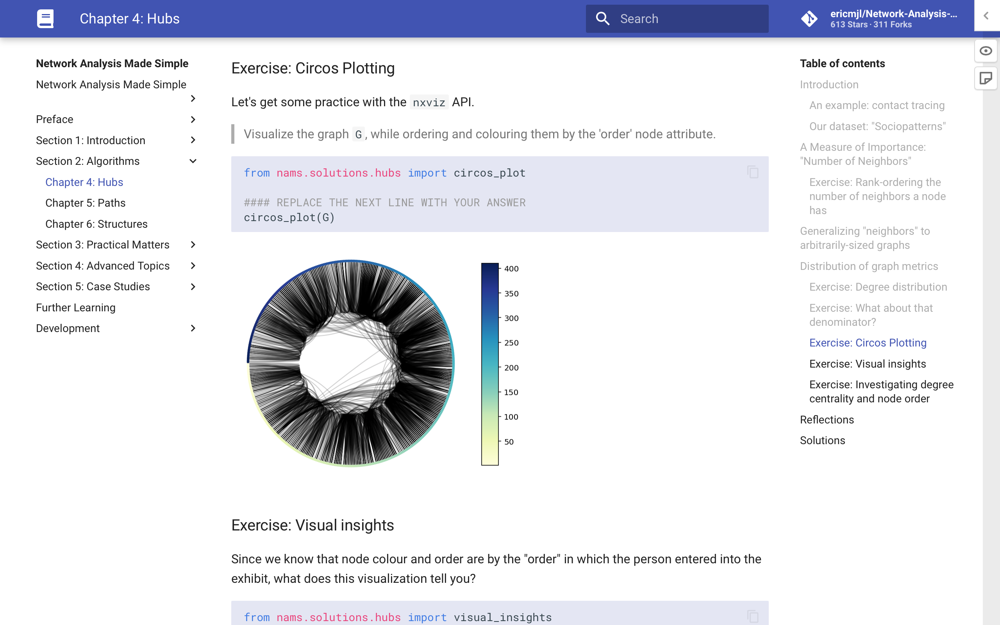

# Principled Data Science Workflow

[Eric J. Ma][web]

[web]: https://ericmjl.github.io/

---

## `About::Work`

_I accelerate biological and chemical research using machine learning methods._

----

"Data scientist" at NIBR.

I've played every role you can think of: protein engineer, data engineer, software engineer, data scientist, scientist who talks to leadership...

----

## `About::Open Source`

----

### [pyjanitor]

> Clean APIs for cleaning data

<small>Beginner-friendly to contribute!</small>

[pyjanitor]: https://pyjanitor.readthedocs.io

----

### [Network Analysis Made Simple][nams]

> Teaching applied network science

Freely available for all [on the web][nams].

[nams]: https://ericmjl.github.io/Network-Analysis-Made-Simple/

----

</img>

We have a [book][leanpub] you can purchase! (Also raffling two download codes for today's talk!)

[leanpub]: http://leanpub.com/nams

----

### [The Art of Data Science][tads]

<a href="https://leanpub.com/tads"></img></a>

Come let us know if you're interested in reading it!

[tads]: https://leanpub.com/tads

---

## The Principles

- Define impact
- Sane conventions
- Develop portably
- Automate reproducibility
- Define source of truth

---

## Liebig's Law of the Minimum

> Growth is dictated not by total resources available, but by the scarcest resource (limiting factor).

(Ref.: [Wikipedia][liebig])

[liebig]: https://en.wikipedia.org/wiki/Liebig%27s_law_of_the_minimum

---

## What's wrong?

----



----




----



----

## What's wrong?

----

## What questions do you have when you approach a project?

_All of the answers to my examples above will be in the negative._

---

### Where are \[X\] located?

X belongs in the set of:

- the notebooks
- the custom source code
- the documentation for the project

----

### What's the "latest status of analysis" update?

- Where's the dashboard/web app that powers this analysis?
- Is the analysis up-to-date, such that

----

### Where is the one- or two-line bash to recreate the environment?

- Is there a conda command?
- How about a Dockerfile?

----

### How do I get access to the data backing the analysis?

- What credentials should I pick up?
- What database connection strings do I need?
- Which parquet file in AWS should I be targeting?

----

### How do I know your custom source code is correct?

- Where's your _test suite_?
- Is the test suite continuously run, thus guaranteeing robustness?

---

## Principled Workflow 1: Define Impact

----

_Always, always_ define what impact looks like before you embark on a project.

----

What does "production" look like?

----

API?

```
curl https://my.company.server/predict/
```

----

Software library?

```python
from project_source import stuff
```

----

Dashboard?

```
https://my.company.server/dashboard
```


----
Excel spreadsheet?

```
./outputs
|- model_output-20200721.xlsx
```

----

Auto-generated emailed reports to leadership inboxes?

----

Surrounding the data science project often is a bunch of software.

We might as well learn from software developers.

----

[_Shape up_][shapeup] the project.

[shapeup]: https://basecamp.com/shapeup

<small>The book is geared towards software teams. Data teams will need to adapt.</small>

----

Work backwards from the end goal, or design your project [outside-in].

[outside-in]: https://medium.com/@jejo.math/writing-software-from-the-outside-in-e5359f60fa30

----

Most complex model not always needed.

----

If `<simple model here>` solves your problem...

...then that's what you should use.

----

Oftentimes, the _harder_ part is satisfying client requests
using code.

----

"We might as well learn from software developers."

---

## Principled Workflow 2: Sane conventions

----

### One project, one directory

```
./   # my project directory
```

----

### One directory, one git repository

```
./
|- .git/
```

----

#### One project, one environment

```
./
|- .git/
|- environment.yml
```

----

#### One project, one custom source package

```
./
|- .git/
|- environment.yml
|- src/
   |- proj_package/
   |- setup.py
```

----

Minimize code duplication. Single source of truth. Easier to test.

Good software: "well-defined categories of things".

----

### One project, one notebooks directory

```
./
|- .git/
|- environment.yml
|- src/
   |- proj_package/
   |- setup.py
|- notebooks/
```

----

### One source directory, one test suite

```
./
|- .git/
|- environment.yml
|- src/
   |- proj_package/
   |- setup.py
   |- tests/
|- notebooks/
```

----

### One project, one README

```
./
|- .git/
|- environment.yml
|- src/
   |- proj_package/
   |- setup.py
   |- tests/
|- notebooks/
|- README.md
```

----

### One project, one docs suite

```
./
|- .git/
|- environment.yml
|- src/
   |- proj_package/
   |- setup.py
   |- tests/
|- notebooks/
|- README.md
|- docs/
```

----

### Cookie cutters are pretty rad

- [Cookiecutter][ck]
- [Cookiecutter Data Science][ckds]
- [Kedro][kedro]

[ck]: https://cookiecutter.readthedocs.io/en/1.7.2/
[ckds]: https://drivendata.github.io/cookiecutter-data-science/
[kedro]: https://github.com/quantumblacklabs/kedro

---

## Principled Workflow 3: Develop Portably


----

You want to be able to work on any machine, not just your laptop.

----

If you can develop your project on any machine,
your end product has a chance of being portable across any machine too.

----

A sane baseline environment file:

```yaml
name: my-project-name
channels:
- conda-forge
dependencies:
- python=3.8
- jupyter
- conda
- mamba
- ipython
- ipykernel
- numpy
- matplotlib
- scipy
- pandas
- pip
- pre-commit
- black
- nbstripout
- mypy
- flake8
- pycodestyle
- pydocstyle
- pip:
  - mkdocs
  - mkdocs-material
  - mkdocstrings
  - mknotebooks
```

----

Environment files don't worry about the operating system.

----

If you need system-wide packages, you need a `Dockerfile`.

----

If you're going to deploy in a containerized environment, you need a `Dockerfile`.

----

```Dockerfile
FROM continuumio/miniconda3

COPY environment.yml /tmp/conda-tmp/.
RUN conda env create -f /tmp/conda-tmp/environment.yml && \
    rm -rf /tmp/conda-tmp/
```

Modified from [here][essays].

[essays]: https://github.com/ericmjl/essays-on-data-science/blob/master/.devcontainer/Dockerfile

----

Building an app? Dockerfile is probably necessary.

---

## Principled Workflow 4: Automate Reproducibility

----

`Makefiles` are your friend.

----

```Makefile

init:
    bash install.sh

test:
    pytest -v --cov

docs:
    mkdocs build

train:
    python scripts/model_training.py

app:
    streamlit run apps/app.py
```

----

Wrap commonly-executed bash commands inside a Makefile command so they are easy to execute.

----

Easily-executable commands make your Jenkins or Travis or Azure pipelines easy to develop.

----

If the project has a defined "production" end-point, then everything before it must be made reliable.

----

### Write tests for your data

----

They may change under you, breaking things in unexpected ways.

----

The simplest data test:

```python
def test_data_loading():
    data = load_some_data()
    assert set(data.columns) == set([...])
```

----

Schema validation with [pandera]:

```python
import pandas as pd
import pandera as pa

# data to validate
df = pd.DataFrame({
    "column1": [1, 4, 0, 10, 9],
    "column2": [-1.3, -1.4, -2.9, -10.1, -20.4],
    "column3": ["value_1", "value_2", "value_3", "value_2", "value_1"],
})

# define schema
schema = pa.DataFrameSchema({
    # Column 1 gets a "statistical support" check
    "column1": pa.Column(pa.Int, checks=pa.Check.less_than_or_equal_to(10)),
    "column2": pa.Column(pa.Float, checks=pa.Check.less_than(-1.2)),
    "column3": pa.Column(pa.String, checks=[
        pa.Check.str_startswith("value_"),
        # define custom checks as functions that take a series as input and
        # outputs a boolean or boolean Series
        pa.Check(lambda s: s.str.split("_", expand=True).shape[1] == 2)
    ]),
})

validated_df = schema.validate(df)
print(validated_df)
```

[pandera]: https://pandera.readthedocs.io/en/stable/

----

More tools:

- [Pandera][pandera]
- [Great Expectations](https://greatexpectations.io)


[pandera]: https://pandera.readthedocs.io/en/stable/
----

CI systems that automatically execute tests on every git commit give you confidence that source code is correct.

----

CI systems that automatically execute analyses to ensure they are _at least_ not borked let you quickly isolate changes and feed them back.

----

CI systems that automatically build and generate model artifacts save you time opening your notebooks.

---

## Principled Workflow 5: Define source of truth

----

One source library for project with minimized code duplication.

----

No copies of data. Pull from the raw-est source. Transform using code.

----

All transformations done with code.
No manual Excel handling.

Excel is great for prototyping, but very quickly you should translate into code.

----

Develop shortcut functions to your data.

----

```python
# src/project_source/data.py
import pandas as pd
import wget

def load_some_raw_data():
    """
    Very informative docstring goes here.

    Describe provenance of data, and data involved.
    """
    remote_url = "..."
    filename = wget.download(remote_url)
    return pd.csv(filename)
```

----

```python
import janitor  # gives you some API superpowers!
from functools import lru_cache  # alternative: cachier

@lru_cache(maxsize=32)  # speeds up reload time
def load_some_transformed_data():
    """
    Very informative docstring goes here.

    Describe provenance of data,
    and why transforms were done.
    """
    data = (
        load_some_raw_data()
        .add_column(...)
        .transform_column(..., np.log10, "log_transformed")
        .dropnotnull(...)
    )
    return data
```

----

- [Intake][intake]: An alternative to data loading functions.
- [Kedro][kedro] pipelines: Tries to be a catch-all.


[intake]: https://github.com/intake/intake
[kedro]: https://github.com/quantumblacklabs/kedro

----

### One source for documentation

----

```
./
|- docs/
   |- index.md
   |- more.md
   |- contributing.md
```

----

### Docs generators:

- [MkDocs][mkdocs] and [MkDocs Material][mkdocsmat]
- [Sphinx][sphinx]

[mkdocs]: https://www.mkdocs.org
[mkdocsmat]: https://squidfunk.github.io/mkdocs-material/
[sphinx]: https://www.sphinx-doc.org/en/master/

----

Build and publish your docs on every project rebuild.


----

Beautiful websites like:



----



----

This `Makefile` line:

```Makefile
docs:
    mkdocs build
```

gives you this bash line:

```bash
make docs # :)
```

---

## (Perfect) Practice Makes Perfect

Habits build up over time.

----

### Liebig's Law of the Minimum

> Growth is dictated not by total resources available, but by the scarcest resource (limiting factor).

----

Your project will move as far/fast/high as the the biggest limiting factor will limit it.

----

What are you held back by?

<small>There's probably a software practice that you can adapt!</small>

----

<small>Manually checking the same things?</small>

Automate it!

----

<small>Data issues failing you?</small>

Automate checks!

----

<small>Unstable copy/pasted code?</small>

Refactor it!

----

<small>Environment can't be reproduced?</small>

Declare it!

----

<small>Can't remember how to do things?</small>

Document it!

---

## The Principles

- Define impact
- Sane conventions
- Develop portably
- Automate reproducibility
- Define source of truth

---

## FAQ

----

### I don't have time to adopt all of these practices!

Sorry, but you will have even less time, and many-fold more stress, if you don't!

----

### Where do you find time to adopt all of these practices?

You build them in one-by-one.

The time will come back to you many-fold.


----

### My "clients" won't give me the time to adopt these practices. What do we do?

Earn credibility points by delivering something that they want.

Then spend the credibility points on requests for time to build reliability.

Build the virtuous cycle.

----

###
